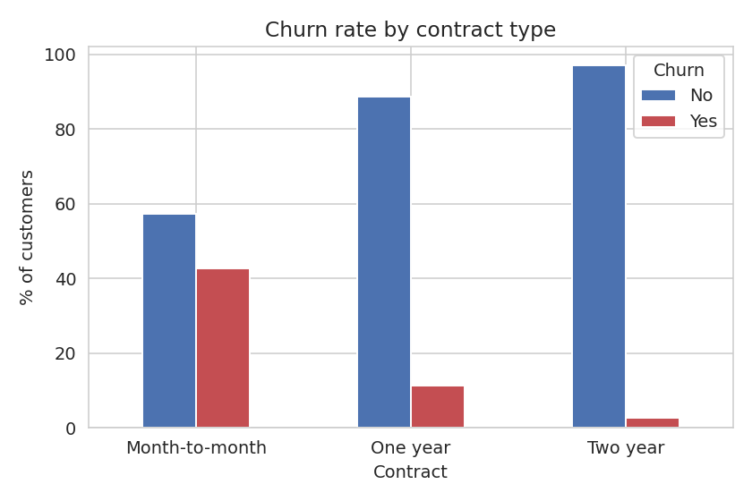
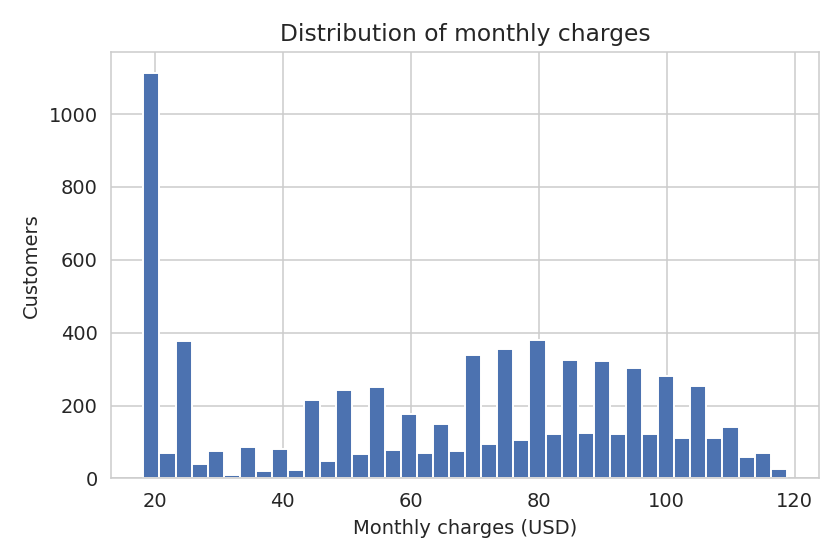
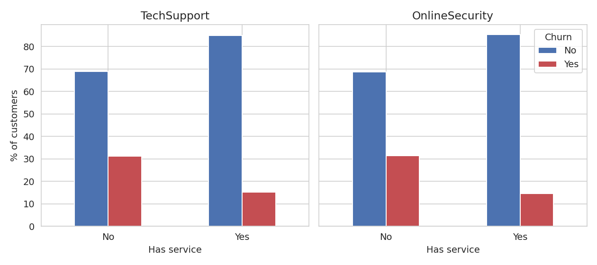
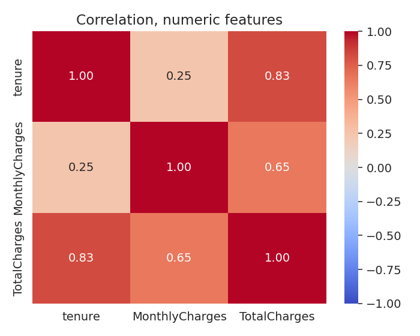
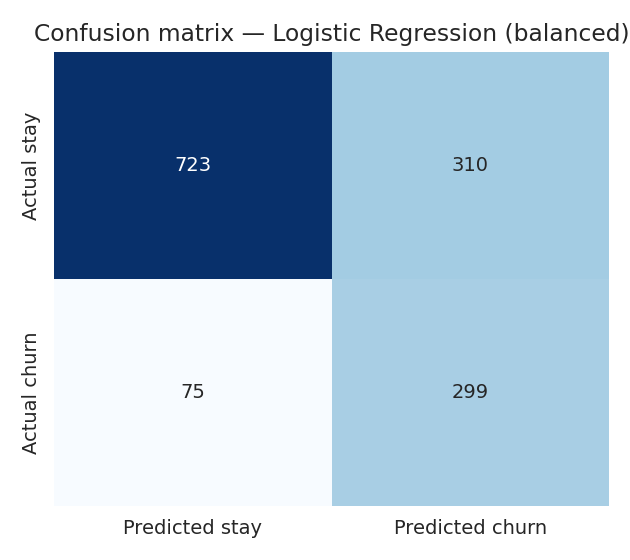
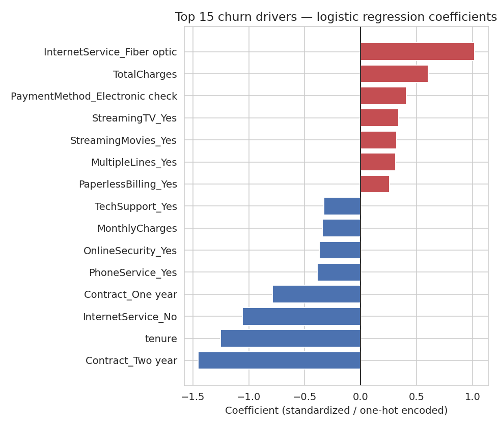

<div align="center">

<h1 align="center" style="font-family: 'Fira Code', 'Consolas', 'Courier New', monospace; letter-spacing: 0.08em;">
  CUSTOMER CHURN PREDICTION
</h1>

<p align="center">
  
  
  
  
</p>

</div>

Telecom churn prediction on IBM's Telco Customer Churn dataset. The analysis
starts with 7,043 customers; `TotalCharges` arrived as text, and 11 rows had
blank values — all were brand-new sign-ups with `tenure == 0` and no bill yet.
After converting to numeric and dropping those rows, 7,032 customers remained,
with 26.6% churning.

| Metric | Value |
|---|---:|
| **Customers** | 7,032 |
| **Churned** | 26.6% |
| **Model** | Logistic Regression (balanced) |
| **Recall on churn** | 0.80 |
| **ROC-AUC** | 0.84 |

## Overview

### Why this rebuild

The original notebook contained a real, silent bug: the encoding loop was guarded
by `if df[col].dtype == 'object':`, which is `False` for string columns in recent
pandas versions (3.0+ defaults to a new string dtype, not `object`). Because of
that, the label-encoding step never ran, and the model was trained on raw string
values without raising any error.

A second issue was in the write-up: the notebook claimed all coefficients were
negative and that labels had likely been reversed, but the actual model output
showed 8 of 19 coefficients were positive. The documentation did not match the
analysis, and both issues are documented in the repaired notebook:
[`notebooks/Customer_Churn_Analysis.ipynb`](notebooks/Customer_Churn_Analysis.ipynb).

This rebuild also replaces `LabelEncoder` with a `ColumnTransformer` +
`OneHotEncoder`, and uses a stratified train/test split so the ~27% churn rate
is preserved in both subsets.

## Key findings

### Contract length dominates



Month-to-month customers churn far more than those on longer contracts:
1,655 of 3,875 left, or 42.7%. One-year contracts drop to 11.3% (166/1,472),
and two-year contracts fall to 2.8% (48/1,685). A chi-square test confirms
contract length is the strongest categorical predictor in the dataset
(χ² = 1,179.6, p ≈ 7×10⁻²⁵⁷), well ahead of internet service type
(χ² = 728.7) and payment method (χ² = 645.4). `PhoneService` (p = 0.35) and
`gender` (p = 0.49) show little to no signal.

### Costs and service patterns matter



Churned customers pay more on average — $74.44/month versus $61.31 for those
who stayed. A Welch's t-test confirms the difference is statistically
significant (t = 18.34, p ≈ 3×10⁻⁷²), which aligns with the fiber and
streaming patterns below rather than acting as an independent effect.



Without tech support, churn reaches 31.2%; with it, it falls to 15.2%. Online
security behaves similarly (31.4% vs 14.6%). Online backup narrows the gap but
does not eliminate it (29.2% vs 21.6%).



Tenure and total charges have a strong relationship (0.83), which is expected
because total charges accumulate over time. Tenure versus monthly charges is
lower at 0.25, indicating they carry mostly independent information.

## Model comparison

### Candidate models

Three models were tested with the same preprocessing pipeline and a stratified
80/20 split:

| Model | Accuracy | Precision | Recall | F1 | ROC-AUC |
|---|---:|---:|---:|---:|---:|
| Logistic Regression | 0.803 | 0.648 | 0.567 | 0.605 | 0.836 |
| **Logistic Regression (balanced)** | 0.726 | 0.491 | **0.799** | 0.608 | 0.835 |
| Random Forest (balanced) | 0.785 | 0.626 | 0.479 | 0.542 | 0.822 |

`class_weight='balanced'` has very different effects in a linear model versus a
forest. For logistic regression, it shifts the decision boundary and boosts recall
from 0.57 to 0.80 with a real but manageable precision trade-off. For the random
forest, it only changes how individual trees split, and here it produced the
lowest recall of the three models. ROC-AUC stays close across all three, which
indicates this was a genuine precision/recall trade-off rather than a difference
in separability.

**Selected model: Logistic Regression (balanced).** A missed churner costs more
than a wasted retention call, so the recall gain is worth the precision it gives
up. The coefficients also explain why a customer was scored as high risk, which a
300-tree forest does not.



The model catches 299 of 374 churners in the hold-out set (80% recall) while
producing 310 false alarms among customers who stayed. 75 churners still slip
through.

## What drives the score



### Risk pushes upward

- Fiber-optic internet: +1.02
- Higher total charges: +0.60
- Electronic check payment: +0.41
- Streaming TV / movies: +0.34 and +0.33
- Multiple phone lines: +0.31
- Paperless billing: +0.26

### Risk pushes downward

- Two-year contract: −1.46
- Longer tenure: −1.25
- No internet service at all: −1.06
- One-year contract: −0.79
- Having phone service: −0.39
- Online security: −0.37
- Higher monthly charges on their own: −0.34
- Tech support: −0.33

This aligns with the earlier crosstabs: contract length and internet type were the
strongest raw-data splits, and the model captured the same story rather than
finding something the EDA missed.

## Try it

### Quick start

```bash
pip install -r requirements.txt
streamlit run app.py
```

Enter a customer's tenure, charges, contract, and service mix. The app scores the
customer with the saved pipeline and returns a churn probability plus a stay/churn
call using the 0.5 threshold.

## Repository map

```text
customer-churn-prediction/
├── app.py                          # Streamlit form -> single prediction
├── train_model.py                 # Cleans data, compares 3 models, saves the artifact
├── generate_figures.py            # Regenerates every chart + metrics.json above
├── churn_production_model.pkl     # Saved sklearn Pipeline + threshold + metrics
├── data/
│   └── WA_Fn-UseC_-Telco-Customer-Churn.csv
├── notebooks/
│   └── Customer_Churn_Analysis.ipynb  # Full EDA + modeling walkthrough, real outputs
├── assets/                       # Charts used above, regenerated by generate_figures.py
├── requirements.txt
├── LICENSE
└── README.md
```

## Data

[IBM Telco Customer Churn](https://raw.githubusercontent.com/IBM/telco-customer-churn-on-icp4d/master/data/Telco-Customer-Churn.csv) —
7,043 customers, 21 columns, one row per customer.

## License

MIT — see [LICENSE](LICENSE).
